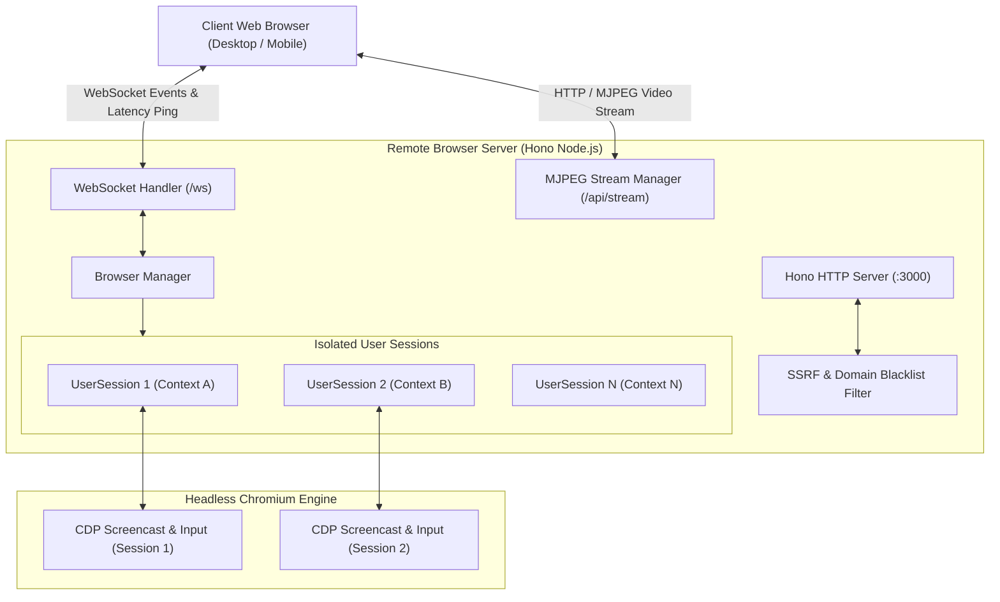

# Remote Browser 🌐

> Turn your VPS into a high-performance, multi-user remote web browser accessible from any device.

[](https://www.typescriptlang.org/)
[](https://hono.dev/)
[](https://playwright.dev/)
[](https://github.com/websockets/ws)
[](#license)

**Remote Browser** is a lightweight, low-latency remote browser isolation (RBI) solution built on **Node.js**, **Hono**, **Playwright**, and the **Chrome DevTools Protocol (CDP)**. It streams isolated Chromium browser sessions directly into modern web browsers over HTTP (MJPEG) or WebSocket, offering a seamless desktop and mobile browsing experience without running any local browser engine.

---

## ✨ Features

- 👥 **Multi-User Isolation**: Each user session gets a dedicated, fully isolated Chromium `BrowserContext` (independent cookies, storage, cache, tabs, and viewport).
- 🎥 **Dual Streaming Modes**:
  - **HTTP MJPEG Stream**: Zero-dependency, standards-based multipart JPEG stream using Hono's `stream()` helper for universal compatibility.
  - **WebSocket Canvas Stream**: Binary/Base64 frame streaming directly rendered onto an HTML5 `<canvas>`.
- ⚡ **Low-Latency CDP Engine**: Utilizes Chrome DevTools Protocol (`Page.startScreencast` with frame acknowledgement and dynamic fallback capture) to stream frames with minimal input lag.
- 🗂️ **Tab Management**: Support for up to 5 concurrent tabs per session, complete with real-time page titles, live favicon resolution, and tab closing/switching.
- 📱 **Mobile & Desktop Responsive**:
  - Resolution switcher (Desktop 720p / 1080p, Mobile Portrait 720×1280).
  - Mobile touch gestures: Single-finger drag-to-scroll, pinch-to-scroll, and tap-to-click.
  - Floating **Virtual Text Input Assistant** to ensure smooth typing on mobile devices.
  - Automatic mobile User-Agent and touch event emulation (`Emulation.setTouchEmulationEnabled`).
- 🛡️ **SSRF & Security Blacklist**:
  - Hardened Chromium sandbox flags (`--no-sandbox`, `--disable-local-file-access`, `--disable-file-system`).
  - Blocks loopback, internal IP ranges (`10.0.0.0/8`, `172.16.0.0/12`, `192.168.0.0/16`), and Cloud Metadata services (`169.254.169.254`).
  - Blocks local file access schemes (`file:`, `chrome:`, `view-source:`).
  - Configurable domain blacklist with custom styled restriction pages.
  - Automatically suppresses file download requests and file chooser dialogs.
- 📊 **Real-Time Telemetry**: Live FPS counter, round-trip Ping latency tracker, active client counter, and connection status indicator.
- 📝 **Audit Logging**: Automatic timestamped recording of navigated URLs to `logs/visited_sites.log`.

---

## 🏗️ Architecture



---

## 📦 Project Structure

```
remotebrowser/
├── src/
│   ├── browser/
│   │   ├── blacklist.ts   # SSRF prevention, IP filtering & domain blacklist
│   │   ├── cdp.ts         # Low-level CDP mouse & keyboard input dispatching
│   │   ├── session.ts     # UserSession & BrowserManager lifecycle handling
│   │   └── types.ts       # Protocol types, payloads & stream interfaces
│   ├── public/
│   │   ├── favicon.svg    # Application icon
│   │   └── index.html     # Client SPA UI (Tabs, Omnibox, Stream canvas, Touch)
│   ├── stream/
│   │   └── mjpeg.ts       # Multipart MJPEG stream writer & client broadcaster
│   ├── ws/
│   │   └── server.ts      # WebSocket server for commands, metrics & frame sync
│   └── index.ts           # Hono entrypoint & REST API routes
├── logs/                  # Visit audit logs directory
├── package.json
└── tsconfig.json
```

---

## 🚀 Getting Started

### Prerequisites

- **Node.js**: v18.0.0 or higher
- **npm** or **pnpm** / **yarn**
- **Linux / VPS Environment** (or macOS/Windows for development)

### 1. Installation

Clone the repository and install dependencies:

```bash
git clone https://github.com/yvonuk/remotebrowser.git
cd remotebrowser
npm install
```

Install the required Chromium binaries and Linux system dependencies:

```bash
npx playwright install chromium --with-deps
```

### 2. Development

Run the TypeScript compiler in watch mode alongside the server:

```bash
npm run dev
```

Open your browser and navigate to:
```
http://localhost:3000
```

### 3. Production Build & Start

Compile TypeScript to JavaScript and run the production server:

```bash
npm run build
npm start
```

---

## 🌐 Multi-User Session Usage

By default, visiting `http://localhost:3000` automatically generates a random isolated session ID stored in your browser's `sessionStorage`.

To open or share a specific session across multiple windows or users, provide the `sessionId` query parameter:

```
http://<your-vps-ip>:3000/?sessionId=alice-session
http://<your-vps-ip>:3000/?sessionId=bob-session
```

All users connected to the same `sessionId` will view and interact with the same browser instance in real time. Different session IDs remain completely sandboxed from one another.

---

## 🛠️ REST & WebSocket API

### REST Endpoints

| Method | Endpoint | Description |
|---|---|---|
| `GET` | `/` | Serves the web UI SPA |
| `GET` | `/api/stream?sessionId=<id>` | HTTP Multipart MJPEG live video stream |
| `GET` | `/api/session?sessionId=<id>` | Get current session details (tabs, active tab, viewport, config) |
| `GET` | `/api/tabs?sessionId=<id>` | List all open tabs for the session |
| `POST` | `/api/tabs` | Create a new tab (`{ "url": "https://example.com" }`) |
| `DELETE`| `/api/tabs/:id` | Close an open tab by ID |
| `POST` | `/api/navigate` | Navigate active tab to a URL (`{ "url": "https://example.com" }`) |
| `GET` | `/api/stats?sessionId=<id>` | Retrieve session metrics (FPS, frame count, active clients) |
| `GET` | `/api/blacklist` | List all blacklisted domains |
| `POST` | `/api/blacklist` | Add a domain to the blacklist (`{ "domain": "example.com" }`) |
| `DELETE`| `/api/blacklist` | Remove a domain from the blacklist (`{ "domain": "example.com" }`) |

### WebSocket Protocol (`/ws?sessionId=<id>`)

Client-to-server messages:
- `{ "type": "mouse", "event": "move"|"down"|"up"|"wheel"|"click"|"contextmenu", "x": 0, "y": 0, ... }`
- `{ "type": "key", "event": "down"|"up"|"text", "key": "Enter", "modifiers": { ... } }`
- `{ "type": "navigate", "url": "https://github.com" }`
- `{ "type": "nav_action", "action": "back"|"forward"|"reload"|"stop"|"home" }`
- `{ "type": "tab_action", "action": "create"|"close"|"switch", "tabId": "...", "url": "..." }`
- `{ "type": "viewport", "width": 1280, "height": 720 }`
- `{ "type": "stream_config", "fps": 30, "quality": 75, "mode": "mjpeg"|"websocket" }`
- `{ "type": "ping", "timestamp": 1710000000000 }`

---

## 🔒 Security & Sandboxing

Remote Browser includes several layers of defense designed for multi-tenant and public VPS deployment:

1. **SSRF & Private Network Guard**: Automatically rejects navigation to loopback addresses (`127.0.0.1`, `localhost`), link-local metadata endpoints (`169.254.169.254`), and RFC 1918 private subnets.
2. **Local Protocol Blocking**: Prohibits requests to `file://`, `chrome://`, `view-source:`, and `chrome-extension://`.
3. **Restricted File System Access**: Chromium is launched with `--disable-local-file-access` and `--disable-file-system`. File chooser popups and downloads are automatically cancelled.
4. **Session Isolation**: Each session runs inside an independent Playwright `BrowserContext`, preventing cookie or session leakage across users.

> [!WARNING]
> While Remote Browser sandboxes Chromium execution, you should never enter sensitive credentials, banking passwords, or personal keys into untrusted shared remote browser sessions.

---

## 🚢 VPS Deployment & Exposure

### Running with PM2

To keep the server running persistently in the background:

```bash
npm install -g pm2
npm run build
pm2 start dist/index.js --name "remote-browser"
pm2 save
pm2 startup
```

### Reverse Proxy with Nginx

To expose the application over standard HTTP/HTTPS with WebSocket support and unbuffered streaming:

```nginx
server {
    listen 80;
    server_name browser.yourdomain.com;

    location / {
        proxy_pass http://127.0.0.1:3000;
        proxy_http_version 1.1;

        # WebSocket support
        proxy_set_header Upgrade $http_upgrade;
        proxy_set_header Connection "upgrade";

        # Standard headers
        proxy_set_header Host $host;
        proxy_set_header X-Real-IP $remote_addr;
        proxy_set_header X-Forwarded-For $proxy_add_x_forwarded_for;
        proxy_set_header X-Forwarded-Proto $scheme;

        # Disable buffering for low-latency MJPEG and WebSocket streaming
        proxy_buffering off;
        proxy_cache off;
        proxy_read_timeout 86400s;
        proxy_send_timeout 86400s;
    }
}
```

---

## 📄 License

This project is licensed under the [MIT License](LICENSE).
